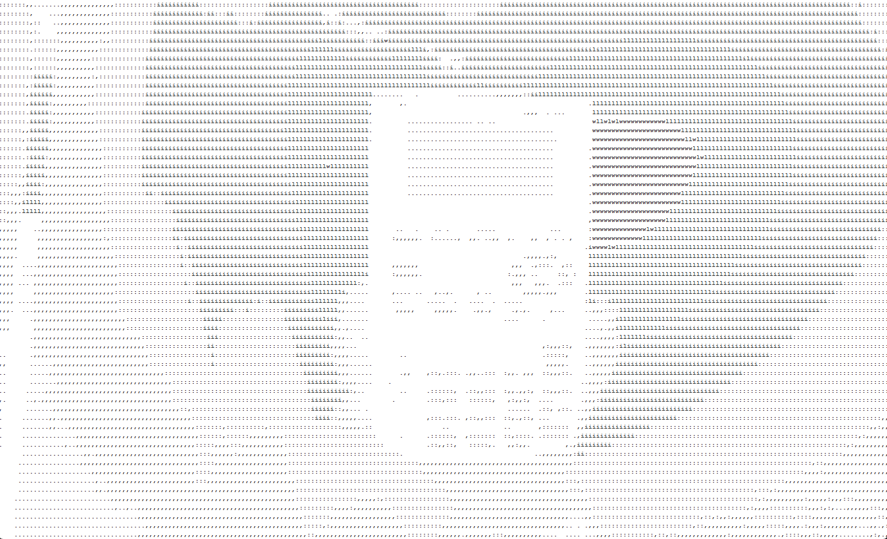
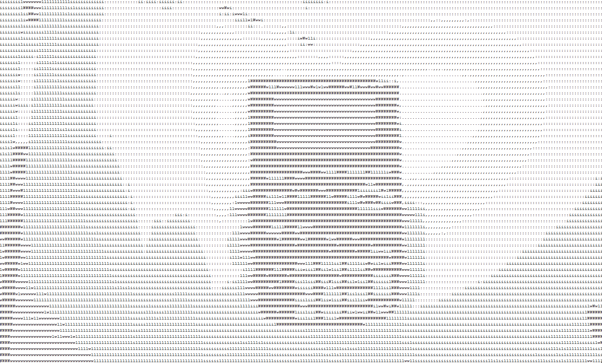
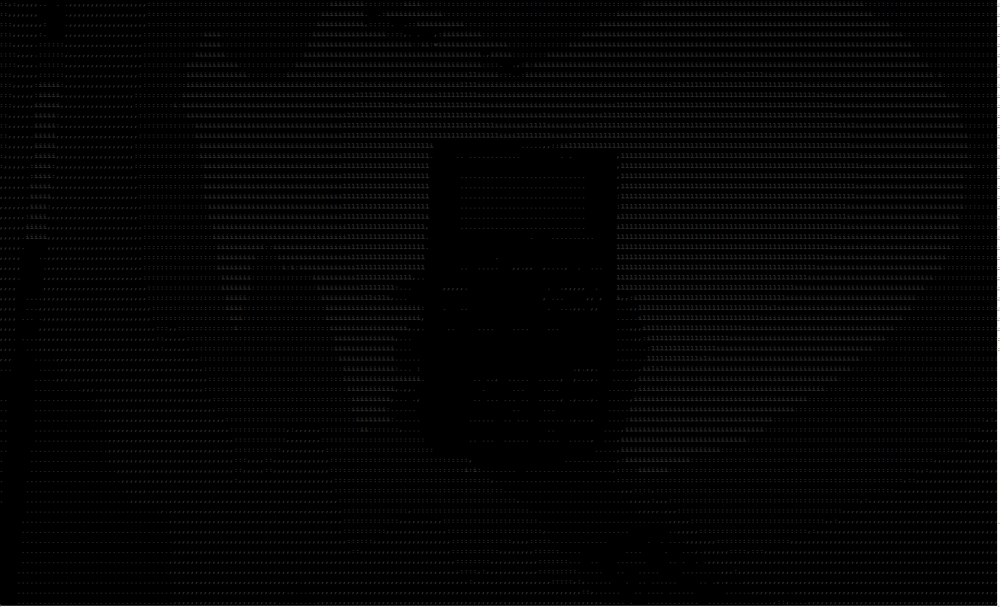

# Background
I came across a youtube video with the channel name [The Coding Train](https://www.youtube.com/watch?v=55iwMYv8tGI&ab_channel=TheCodingTrain) that goes on to convert images into ascii art.  
This sparked my interest and I wanted to make an attempt.  

Below are some results using different "brightness values", having black/white background for example.  
More customizations can be made, for example making the text larger/smaller, adjusting the grayscale, blending past frames etc...

**Below are some examples with a calculator (Texas TI-82)**

### White image with regular brightness
White background with black text, this gives a bigger contrast and is not that good for details.  
The buttons are not that visible but the calculators form is very presentable.
  
### White image with reversed brightness
White background with reversed brightness pattern, this results in less contrast but better for small details.  
Compared to the first image, this has a lot more details and the buttons are more prevalent.

### Black image with regular brightness
In my opinion this gives a more true-to-life representation. Almost like a higher resolution.  
This probably has to do with the colors being close to each-other versus being plain white and black.
